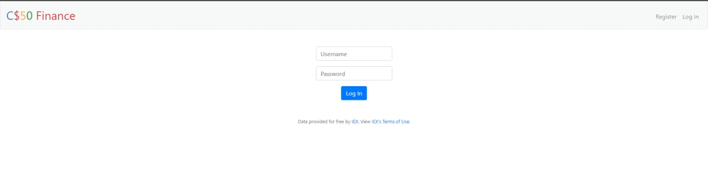
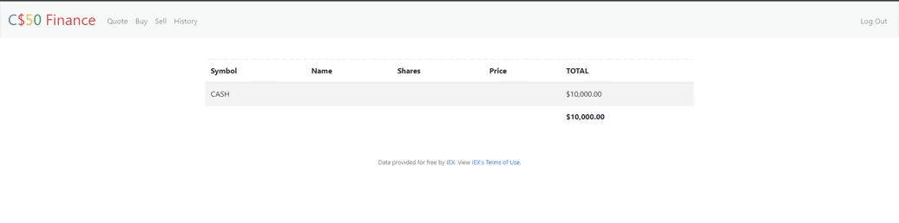
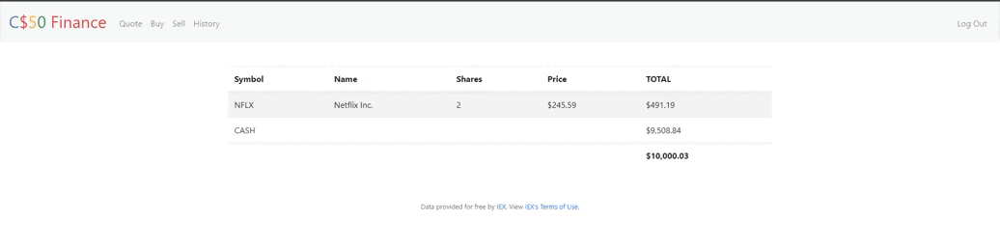

# Сервис для покупки и продажи акций
Проект реализован с использованием фреймворка Flask.

:heavy_dollar_sign:Веб-приложение, позволяющее пользователям покупать и продавать акции. Пользователи могут регистрироваться на сайте и пополнять свой портфель.

На сервисе предусмотрена аутентификация пользователей:

Возможность просматривать цены акций:

Возможность покупать акции:

Возможность продавать акции:

Логины и пароли пользователей хранятся в базе данных SQLite.

Вы можете запустить этот проект локально, выполнив следующие действия:

- Скопируйте данный репозиторий командой `git clone https://github.com/RomanMRR/finance.git`
- `cd finance/finance`
- `export API_KEY=your_key` (Ключ API можно получить на  [сайте](https://iexcloud.io/cloud-login#/register/))
- `flask run`

